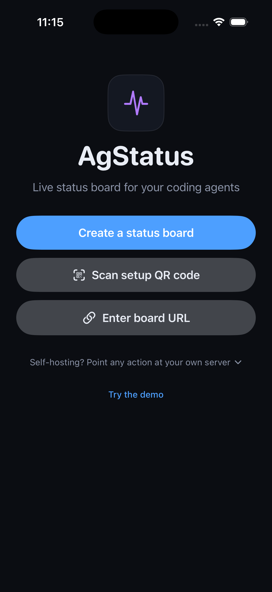
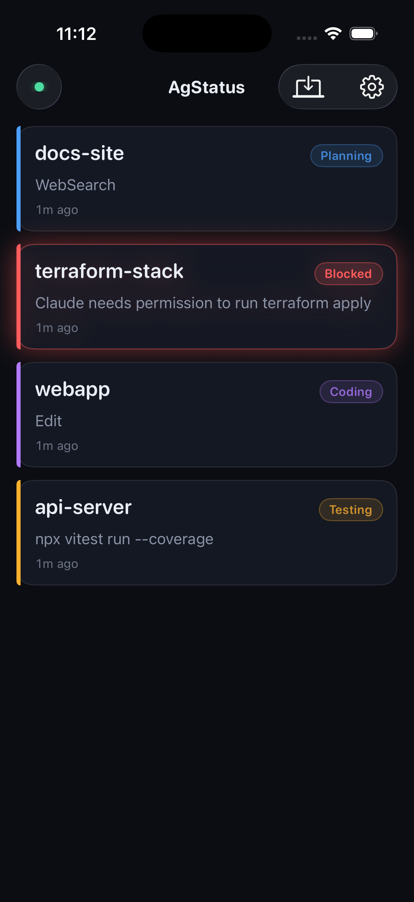
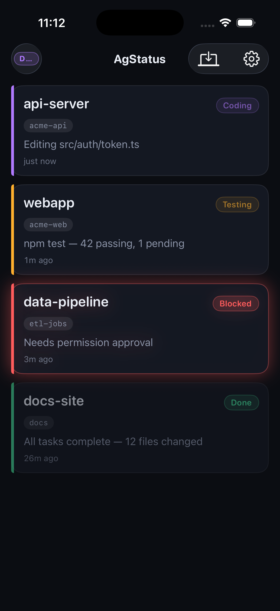
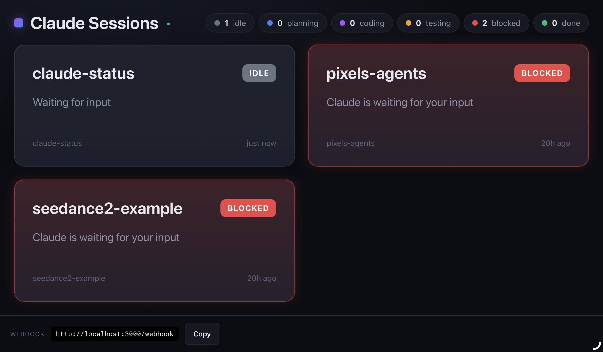

# AgStatus

**Live status board + push alerts for your coding agents — see every Claude Code and Codex session at a glance.**

[](https://github.com/KardanovIR/claude-status-dashboard/actions/workflows/ci.yml)
[](https://github.com/KardanovIR/claude-status-dashboard/actions/workflows/gitleaks.yml)
[](LICENSE)

<p align="center">
  
  
  
</p>

## How it works

A tiny hook posts a webhook every time your agent starts a session, edits a
file, runs tests, or needs your input — the same dependency-free script plugs
into both Claude Code's hooks and OpenAI Codex's lifecycle hooks. The server
keeps a live board of every session — color-coded
`idle / planning / coding / testing / blocked / done` — and streams changes to
the web dashboard and the iOS app over Server-Sent Events. When an agent
transitions into `blocked`, the server pushes a notification to your phone,
so you step away from the keyboard without losing the thread.

## Get started in 60 seconds

1. **Get the board on your phone** — the AgStatus iOS app (App Store
   submission in progress; until it's live, open `ios/AgStatus.xcodeproj` in
   Xcode and run it — a simulator build needs no signing). No iPhone? Your
   board URL works in any browser.
2. **Wire up your machine:**

   ```bash
   npx agstatus init
   ```

   One command: creates a private board on the hosted instance, installs a
   dependency-free Node hook, registers it in `~/.claude/settings.json` (with
   a backup) — and in `~/.codex/hooks.json` when Codex is detected — then
   prints your board URL plus a QR code to open it on your phone. (Codex asks
   you to trust the new hook once: run `/hooks` inside Codex.)

3. **Start a Claude Code session** — a card appears on the board and follows
   the agent through `idle → coding → testing → …` as it works.

Created the board in the app first? Pair your machine to it with a code:
`npx agstatus init --code XXXX-XXXX`. Details in [docs/hooks.md](docs/hooks.md).

## Features

- **Claude Code + OpenAI Codex** — one hook script speaks both tools'
  hook systems; sessions from both land on the same board.
- **Live board** — SSE-streamed updates, no polling, no refresh.
- **No accounts** — a board is a capability URL with an unguessable token,
  like a Slack webhook. The server stores only a hash of it.
- **Push when blocked** — APNs notification the moment an agent needs you;
  opt-in per device for `done` too.
- **QR pairing** — the CLI prints a QR to open your board on the phone; the
  app hands out short-lived codes to pair more machines.
- **Demo mode** — try the iOS app with fake sessions, no server, no data sent.
- **Privacy switch** — `--minimal` sends tool names only, never command text.
- **Self-hostable** — one Node process, optional PostgreSQL persistence, Docker image,
  bundled TLS proxy. Single-user and multi-tenant modes.
- **MIT licensed** — server, dashboard, CLI, and apps.

## Self-hosting

[](docs/self-hosting.md)

```bash
docker run -d -p 3000:3000 ghcr.io/kardanovir/agstatus
```

(The image is published from tagged releases; until the first one lands, clone
the repo and `docker compose up -d --build`.) Persistence, TLS via the bundled
Caddy profile, multi-tenant mode, push-notification setup, and the full
environment-variable reference are in **[docs/self-hosting.md](docs/self-hosting.md)**.

## Project layout

```
claude-status/
├── src/              # Server: Express + SSE + PostgreSQL store + APNs push (TypeScript)
├── public/           # Web dashboard: vanilla JS, no build step
├── cli/              # `npx agstatus` setup CLI + the Node hook it installs
├── hooks/            # Original bash hook for manual setup
├── ios/              # AgStatus: native SwiftUI app (+ legacy ClaudeStatus WebView app)
├── integrations/     # Android WebView client
├── deploy/           # Caddyfile for the TLS compose profile
├── test/             # Server test suite (Vitest)
├── docs/             # Guides, API reference, privacy policy, screenshots
├── Dockerfile        # Multi-arch image (published as ghcr.io/kardanovir/agstatus)
└── docker-compose.yml
```

## Documentation

- [Self-hosting guide](docs/self-hosting.md) — quick start, env vars, TLS, push setup
- [HTTP API reference](docs/api.md) — webhook, workspaces, pairing, devices, SSE
- [Claude Code integration](docs/hooks.md) — `agstatus init`, event mapping, manual setup
- [Privacy policy](docs/privacy.md) — what the hosted instance stores and for how long
- [Contributing](CONTRIBUTING.md) · [Security policy](SECURITY.md)

## License

[MIT](LICENSE) © Inal Kardanov.

AgStatus is an independent open-source project that works with Claude Code's
and OpenAI Codex's hook systems. It is not affiliated with or endorsed by
Anthropic or OpenAI.
